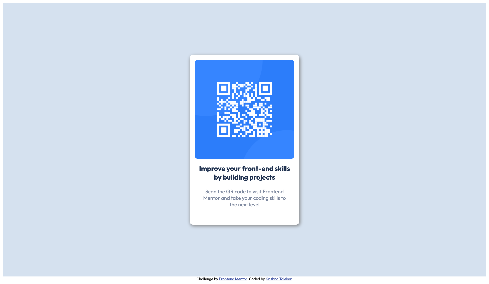

# Frontend Mentor - QR code component solution

This is a solution to the [QR code component challenge on Frontend Mentor](https://www.frontendmentor.io/challenges/qr-code-component-iux_sIO_H). Frontend Mentor challenges help you improve your coding skills by building realistic projects. 

### Screenshot

### Links

- Solution URL: [solution URL](https://github.com/krishnatalekar/qr-code-component)
- Live Site URL: [live site URL](https://krishnatalekar.github.io/qr-code-component/)

### Built with

- Semantic HTML5 markup
- CSS custom properties
- Flexbox
- CSS Grid
- Mobile-first workflow

## Author

- Website - [Krishna Talekar](https://github.com/krishnatalekar)
- Frontend Mentor - [@krishnatalekar](https://www.frontendmentor.io/profile/krishnatalekar)